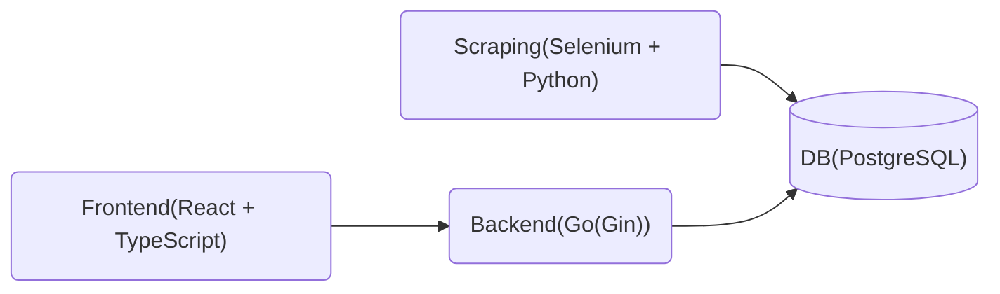

# niconico_recap

## 概要
ニコニコ動画の視聴履歴を自動取得し、履歴の検索やサマリーの表示を行うツールです。  
ニコニコ動画は視聴履歴が最新50件（プレミアム会員は200件）しか保存されないため、それ以前の履歴を保存し、後から見返せるようにすることが目的です。
現在、以下の機能が実装されています。
- 視聴履歴の取得（スクレイピングを用いた自動処理）
- 視聴履歴の検索（タグ、タイトル、視聴期間での検索）
- 視聴履歴のサマリー表示（総視聴回数、よく見たタグ）
- 視聴した動画の詳細表示（タイトル、タグ）

## セットアップ
`scraper/.env`にニコニコ動画のログイン情報を記述してください。
```.env
EMAIL=your_email
PASSWORD=your_password
```

コンテナ起動

```bash
docker compose up -d
```

バックエンドとフロントエンドの起動
```powershell
cd backend
docker compose exec backend go run main.go
cd ../frontend
docker compose exec frontend cd react-app && npm start
```


## 実装
- DB: PostgreSQL
- Scraping: Selenium + Python
- Backend: Go(Gin)
- Frontend: React + TypeScript


